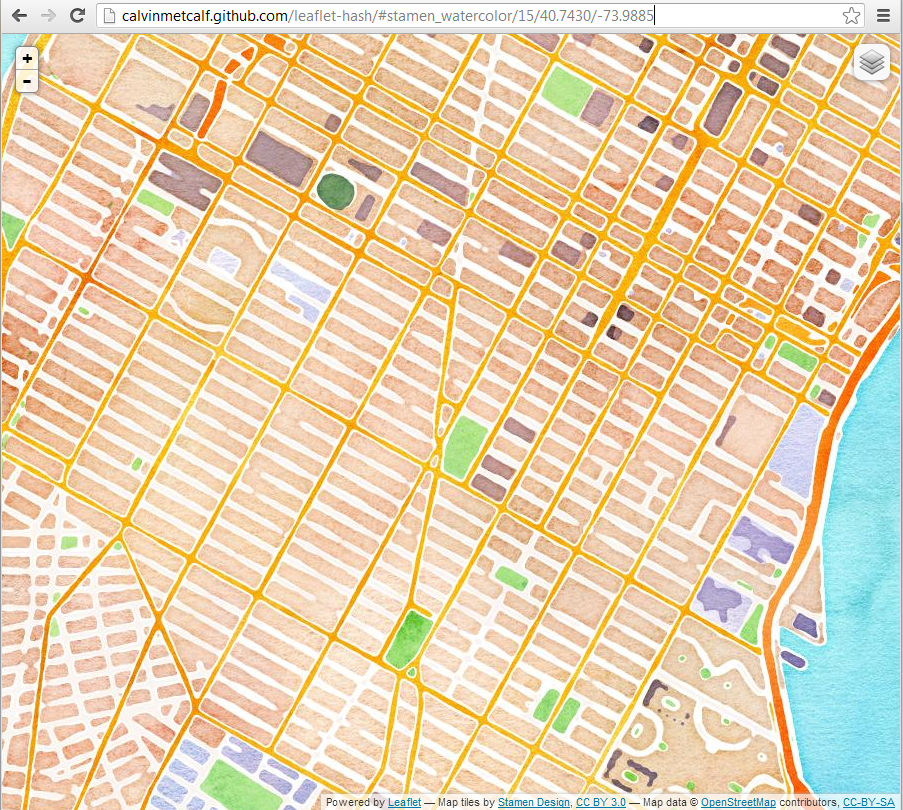

# Leaflet-hash

Leaflet-hash lets you to add dynamic URL hashes to web pages with Leaflet maps. You can easily
link users to specific map views.



### Demo
You can view a demo of leaflet-hash at [calvinmetcalf.github.com/leaflet-hash](http://calvinmetcalf.github.com/leaflet-hash).

### Getting started

1. Prepare a basic leaflet map. You can find instructions on [Leaflet's quick-start guide](http://leaflet.cloudmade.com/examples/quick-start.html).

2. Include [leaflet-hash.js](https://github.com/calvinmetcalf/leaflet-hash/blob/master/leaflet-hash.js).

3. Once you have initialized the map (an instance of [L.Map](http://leaflet.cloudmade.com/reference.html#map-usage)), add the following code:

	```javascript
        // Assuming your map instance is in a variable called map
        map.addHash();
    ```
4. optionally you can pass a an object with a few options
	* lc: pass an instance of L.Control.Layer, the baselayers will be put in the hash
	* path: template for the url hash, defaults to '{z}/{lat}/{lng}' or '{base}/{z}/{lat}/{lng}' if lc is specified, parts need to be seperated by "/"
	* formatBase: an array of length 2 that will be used as the arguments of the overlay names before they go into the url hash, the default turns whitespace to underscores and all lowercase just pass "[//]" if you want it unchanged


### Author
[@mlevans](http://github.com/mlevans)

### Contributors
[@rsudekum](http://github.com/rsudekum)

[@yohanboniface](http://github.com/yohanboniface)

[@calvinmetcalf](http://github.com/calvinmetcalf)

[@tmcw](http://github.com/tmcw)

### License

MIT License. See [LICENSE](https://github.com/calvinmetcalf/leaflet-hash/blob/master/LICENSE.md) for details.